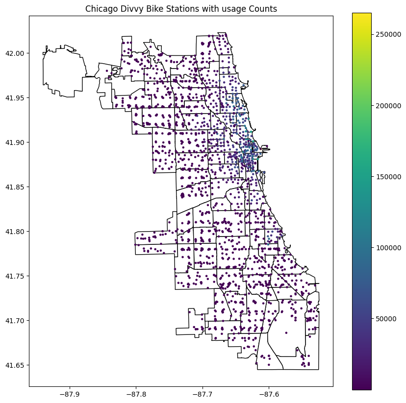

# Chicago Divvy Bike-sharing program bike usage prediction

## Team members

**Hang Tian**(the point of contact)\
github id:ht6631

Mengqi Li\
github id:Adalmqqqq

Vaishnavi Meka\
github id:vaishnavimeka27

## Introduction

The Chicago Divvy Bike-sharing program, managed by the Chicago Department of Transportation (CDOT), is a popular transportation option for both residents and visitors. Understanding the factors that drive bike usage is crucial for stakeholders who are tasked with making decisions about station placement, bike fleet management, and service optimization. By analyzing historical data from 2022 to 2023, this project aims to develop a predictive model to forecast Divvy bike usage across Chicago, providing actionable insights into fleet distribution and operational efficiency.\
\
The primary stakeholder for this project is the Chicago Department of Transportation (CDOT). Our predictive insights into bike usage patterns can guide CDOT in planning and allocating resources for the bike-sharing program, enhancing service availability and reliability. Additionally, this information supports strategic decisions regarding the expansion of services and integration with other transportation modes, aiming to optimize the city’s bike-sharing infrastructure and improve urban mobility.\
\
In this project, we utilized a comprehensive dataset that includes millions of anonymized bike trips, geographical boundaries of Chicago neighborhoods, and environmental factors like weather conditions, combined with public holiday data. By applying machine learning models to these datasets, we have developed predictive tools that can forecast daily bike usage with a high degree of accuracy.

## Literature Review

Studies combining machine learning and bike-sharing usage, including availability prediction and usage prediction starts decades ago with bike-sharing program. In 2017, Ashqar et al[^1]. predicted bike availability at San Francisco Bay Area Bike Share stations using both a univariate regression model with Random Forest and Least-Squares Boosting, and another multivariate regression model with Partial Least-Squares Regression, depicting the spatial correlation between stations in the network. Recent works mainly focused on predicting bike usage with deep learning models. For example, Yang et al. (2018)[^2] emplemented Convolutional Neural Network for both city-level and station-level bike pick-up prediction. Besides, predicting bike usage demand with deep learning algorithms after Covid was a hot-topic(Mehdizadeh et al.,2022)[^3].\
\
In this project, our team aims at predicting city-level bike usage in Chicago city with a wide range of machine learning regression algorithms including XG Boost and Random Forest.

## Data and Methods

### Data

#### 1. Bike-sharing trip data: 
https://divvybikes.com/system-data  ->  https://divvy-tripdata.s3.amazonaws.com/index.html

Since the Divvy bike-sharing program is ran by CDOT (Chicago Department of Transportation), this dataset is highly reliable. We used bike trip data from 2022 to 2023 for this project.

#### 2. Chicago neighbourhoods shapefile: 
https://data.cityofchicago.org/Facilities-Geographic-Boundaries/Boundaries-Neighborhoods/bbvz-uum9

This dataset comes from Chicago open data portal, it's well maintained by Chicago government and highly reliable .

#### 3. Holiday information:
According the calendar, we've compiled all the weekdays and holidays from 2022 to 2023.

#### 4. Daily weather data:
Weather data for 2022 to 2023 collected from the Visual Crossing website.

For the final data, we have total 16555 rows and 13 columns. Including our depedent variable count and log_count, aggregated daily counts of bike usage; weather data: temperature, snow and visibility; date, holiday and weekday information; geographic information and record details.

### Method

### Preprocessing

#### 1. Aggregation of bike trips

The original bike trip data is one row per one trip records including member type, bike type, start and end time and location. If the start or end location is at stations, that information will be recorded in related variables such as "start_station_id", "end_station_id".

The image attached below depict how the original data looks like.

#### 2. Geographic aggregation

We first plan to aggregate them as hourly usage counts with date information, also group by user type, bike types as features. Besides, we have concidered aggregating the records with their start and end locations.

Most of the trips are both started and ended at stations (about 80%) while there are records either not start or end at stations. There are 2000+ unique bike stations involved in these records. That will be a huge number of combination of we aggregate trips per stations (start and end), so we first overlapped the stations with Chicago neighbourhoods. Below are the maps. The value of legend shows how many total start and end cases happened at the very station or within each polygon.

Among these neighbourhoods, five of these neighborhoods clearly have significantly higher usage counts compared to the others as the box plot shows. They are identified as hot zones. Further geographic aggregation of bike tirps will count on if the start and end points are within these hot zones.

#### 3. Merging with holiday information and weather data

For everyday in 2022 and 2023, we labeld if it is during weekday and if that day is a holiday when people don't need to work. The aggregated table is shown as below.

Create a daliy usage count and merge with the data already have holiday and weather information data to get daily data.

#### 4. Outlier removal

There are certain aggregated records with few or several times more records than others, these daily counts are identified as outliers.

### Modeling

To predict the daily usage counts of the Chicago Divvy bike-sharing program, various machine learning models were employed. 

Linear Regression model is the initial model we used. 

Random Forest model give us the features importance.

K-Nearest Neighbors(KNN) model.

Decision Tree model.

Support Vector Regression(SVR) model.

XGBoost model. 

Last we try Neural Network model.

## Results

Using the combination of grid search and five-fold cross validation, the follow figure is a summary plot of our model outputs. 

The comparative performance analysis of different machine learning models for predicting daily bike usage in the Chicago Divvy bike-sharing program reveals that XGBoost outperforms other models with the highest R² of 0.977557 and the lowest RMSE of 0.295426, meaning the average predicted bike usage counts varies from 0.74 - 1.34 times of the true value. This indicates a strong predictive accuracy, suggesting that XGBoost efficiently captures the complex, non-linear relationships within the log-transformed data. Conversely, Linear Regression showed the least effectiveness, highlighting its inadequacy in modeling complex dependencies in such a context. The use of advanced ensemble methods like Random Forest and XGBoost, which reduce the likelihood of overfitting by integrating multiple learning algorithms, evidently enhances model reliability and performance in predicting bike-sharing usage. 
 
 
According to feature importances plot from our Random Forest model, we can get which variables are most influential in predicting the daily usage counts of the Chicago Divvy bike-sharing program. 

The most important feature is rideable_type, which indicates that the type of bicycle used (e.g., standard, electric) plays a crucial role in the prediction of the number of daily uses. Secondly, member_casual indicates whether the user is a member or a casual rider, which also influences bike usage to a large extent. lsholiday, which indicates whether or not a particular day is a holiday, is moderately important, implying that holidays have a significant impact on bike rental patterns. Temperature (temp) also appears to be a key factor, which coincides with seasonal riding habits.

While factors such as isweekday, visibility, and station location variables (at_stations, end_in_hot_zones, start_in_hot_zones) have a lesser impact, they are still important to note. This suggests that the day of the week, weather conditions, and the location of the station in the hotspot also affect bicycle use. To our surprise, snow days were of minimal importance, suggesting that snow days may not be a significant impediment to bicycle use.

## Discussion

**Reflection on the achievement of goals**:

The primary goal of our project is to predict daily bicycle usage to assist CDOT in resource allocation and operational planning. 

The models we built, particularly the XGBoost and neural network models, were able to achieve this goal with high accuracy. These models help predict demand, which in turn helps to better schedule stations and manage the fleet.

**For the needs of our stakeholders CDOT**:

Resource Allocation: Our model's predictions enable CDOT to dynamically allocate bikes across stations based on forecasted demand, thereby reducing bike shortages or surpluses.

Strategic Decision Making: Information from our model about user types and their preferences can guide promotional tactics or membership incentives to increase user engagement and system utilization.

Service Integration: Our model predicts areas and times of high demand, optimizes connectivity and accessibility, and facilitates better integration of the bike-sharing system with other modes of public transportation.

## Limitations

**Data Limitations**:

Forecast accuracy depends to a large extent on the quality of the data used. Problems such as incomplete datasets and missing or inaccurate values (especially for external data such as weather reports) can lead to less reliable forecasts. Prioritizing improvements in data collection, validation and pre-processing is essential to maintain forecast accuracy.

**Geographic Infromation Combination**:

The challenge of effectively combining geographic data with predictive models remains a significant limitation. While current models utilize neighborhood boundaries and prominent locations in cities, the granularity and relevance of geographic areas still needs to be improved. More sophisticated geographic analyses, such as spatial clustering or combining real-time traffic and congestion data, may provide more nuanced insights into bicycle use patterns, especially during peak hours or special events.

**Model generalization and overfitting**:

High accuracy on training or test datasets does not always guarantee that a model will perform well in real-world conditions. There is a risk of overfitting, i.e., the model may not generalize to new, unseen data. The use of techniques such as regularization, cross-validation, and simpler model architectures can help ensure model accuracy and robustness.

## Future work

**Model Enhancements**: 

We can exploring different predictive modeling techniques such as more advanced machine learning algorithms/deep learning models.

**Advanced Feature Engineering**: 

We can explore adding new features, such as user demographics, community-specific characteristics, or historical trends.

**Real-time Predictive Analytics**: 

We can continue evelope a real-time predictive model that can adjust forecasts based on live data feeds could significantly enhance operational responsiveness for the CDOT.

## References
[^1]: Ashqar H I, Elhenawy M, Almannaa M H, et al. Modeling bike availability in a bike-sharing system using machine learning[C]//2017 5th IEEE International Conference on Models and Technologies for Intelligent Transportation Systems (MT-ITS). IEEE, 2017: 374-378.
[^2]: Yang H, Xie K, Ozbay K, et al. Use of deep learning to predict daily usage of bike sharing systems[J]. Transportation research record, 2018, 2672(36): 92-102.
[^3]: Mehdizadeh Dastjerdi A, Morency C. Bike-sharing demand prediction at community level under COVID-19 using deep learning[J]. Sensors, 2022, 22(3): 1060.